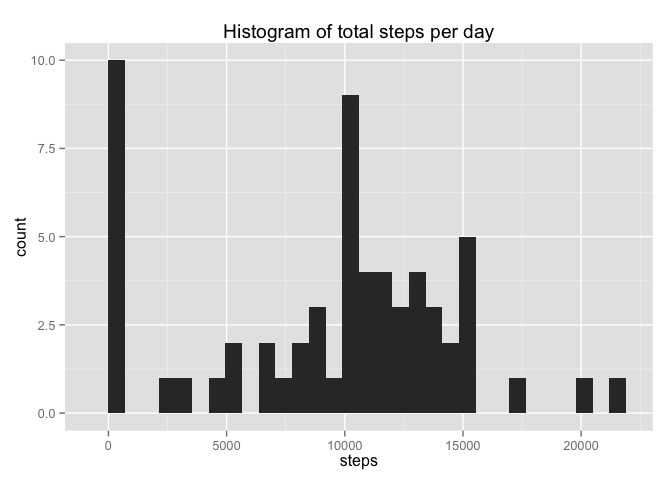
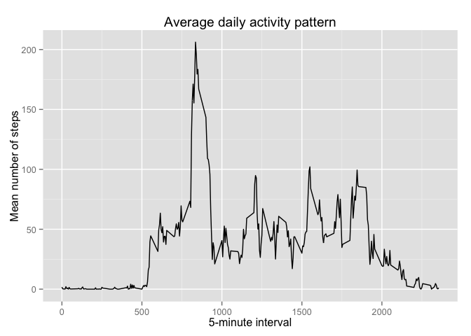
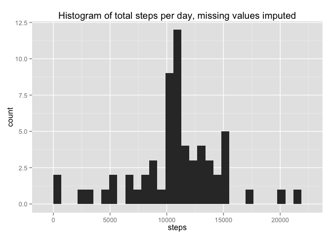
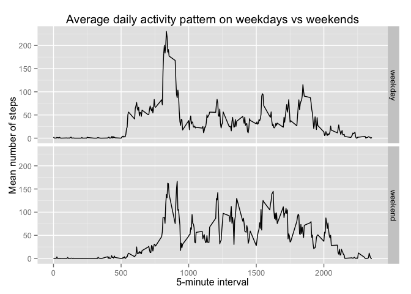

# Reproducible Research: Peer Assessment 1

Before working with the data, I load the packages that will be used during the data processing and analyses.


```r
library(dplyr)
```

```
## 
## Attaching package: 'dplyr'
## 
## The following object is masked from 'package:stats':
## 
##     filter
## 
## The following objects are masked from 'package:base':
## 
##     intersect, setdiff, setequal, union
```

```r
library(ggplot2)
```

## Loading and preprocessing the data

I begin by unzipping the data file if required and loading the data.


```r
if(!file.exists("activity.csv")) {
  unzip("activity.zip")
}
activity <- read.csv("activity.csv")
```

With the data loaded, I can now inspect the structure and see whether any preprocessing is required.


```r
str(activity)
```

```
## 'data.frame':	17568 obs. of  3 variables:
##  $ steps   : int  NA NA NA NA NA NA NA NA NA NA ...
##  $ date    : Factor w/ 61 levels "2012-10-01","2012-10-02",..: 1 1 1 1 1 1 1 1 1 1 ...
##  $ interval: int  0 5 10 15 20 25 30 35 40 45 ...
```

```r
head(activity)
```

```
##   steps       date interval
## 1    NA 2012-10-01        0
## 2    NA 2012-10-01        5
## 3    NA 2012-10-01       10
## 4    NA 2012-10-01       15
## 5    NA 2012-10-01       20
## 6    NA 2012-10-01       25
```

The dates should be converted to the appropriate format to allow any operations or analysis based on dates and days.


```r
activity$date <- as.Date(activity$date)
str(activity)
```

```
## 'data.frame':	17568 obs. of  3 variables:
##  $ steps   : int  NA NA NA NA NA NA NA NA NA NA ...
##  $ date    : Date, format: "2012-10-01" "2012-10-01" ...
##  $ interval: int  0 5 10 15 20 25 30 35 40 45 ...
```

```r
head(activity)
```

```
##   steps       date interval
## 1    NA 2012-10-01        0
## 2    NA 2012-10-01        5
## 3    NA 2012-10-01       10
## 4    NA 2012-10-01       15
## 5    NA 2012-10-01       20
## 6    NA 2012-10-01       25
```

The data is now in a suitable form for completing the required analyses.

## What is mean total number of steps taken per day?

To analyse the number of steps per day, I begin by aggregating the data by date using the `dplyr` package.


```r
activity_by_day <- activity %>%
  group_by(date) %>%
  summarise(steps = sum(steps, na.rm = TRUE))
```

Now that the daily totals have been calculated, I begin by producing a histogram of the total number of steps taken each day. Note that I use `ggplot2` for all graphics in this assessment task.


```r
ggplot(data = activity_by_day, aes(steps)) +
  geom_histogram() +
  ggtitle("Histogram of total steps per day")
```

 

I then calculate the mean and median for the total number of steps per day.


```r
mean(activity_by_day$steps, na.rm = TRUE)
```

```
## [1] 9354.23
```

```r
median(activity_by_day$steps, na.rm = TRUE)
```

```
## [1] 10395
```

## What is the average daily activity pattern?

To analyse the average daily activity pattern, I begin by calculating the mean values for each interval averaged across all dates.


```r
activity_by_interval <- activity %>%
  group_by(interval) %>%
  summarise(mean_steps = mean(steps, na.rm = TRUE))
```

Now I produce a time series plot showing the average daily activity pattern.


```r
ggplot(activity_by_interval, aes(interval, mean_steps)) +
  geom_line() +
  ggtitle("Average daily activity pattern") +
  xlab("5-minute interval") +
  ylab("Mean number of steps")
```

 

Next, I identify which 5-minute interval, on average across all the days in the dataset, contains the maximum number of steps.


```r
activity_by_interval[which.max(activity_by_interval$mean_steps),]
```

```
## Source: local data frame [1 x 2]
## 
##   interval mean_steps
## 1      835   206.1698
```

## Imputing missing values

First, I calculate the total number of missing values in the dataset.


```r
nrow(activity[is.na(activity$steps),])
```

```
## [1] 2304
```

Next, I create a new dataset that fills in the missing values in the original data by using the mean number of steps in the available data for the equivalent interval.


```r
# Use dplyr's left_join to merge the mean steps per equivalent interval into each row of the activity data,
# then substitute that value into the steps column if the actual value is NA.
activity_imputed <- left_join(activity, activity_by_interval) %>%
  mutate(steps = ifelse(is.na(steps), mean_steps, steps))
```

```
## Joining by: "interval"
```

Next, I aggregate the data by day and produce the histogram and calculate the mean and median using the dataset with missing value imputation. These can be compared to the original results above.


```r
activity_by_day_imputed <- activity_imputed %>%
  group_by(date) %>%
  summarise(steps = sum(steps, na.rm = TRUE))
ggplot(data = activity_by_day_imputed, aes(steps)) +
  geom_histogram() +
  ggtitle("Histogram of total steps per day, missing values imputed")
```

 

```r
mean(activity_by_day_imputed$steps, na.rm = TRUE)
```

```
## [1] 10766.19
```

```r
median(activity_by_day_imputed$steps, na.rm = TRUE)
```

```
## [1] 10766.19
```

The values of the mean and median with imputed data are both larger than the values based on the original dataset, ignoring missing values. Imputing missing data has increased the estimated number of steps per day.

## Are there differences in activity patterns between weekdays and weekends?

Using the dataset with imputed values, I create a new factor variable in the dataset with two levels -- "weekday" and "weekend" indicating whether a given date is a weekday or weekend day.


```r
activity_imputed <- activity_imputed %>%
  mutate("day" = weekdays(date)) %>%
  mutate("day_type" = ifelse(day %in% c("Saturday", "Sunday"), "weekend", "weekday"))
activity_imputed$day_type <- as.factor(activity_imputed$day_type)
```

Finally, I calculate the mean number of steps for each interval across each day type. I then make a panel plot containing a time series plot of the 5-minute interval (x-axis) and the average number of steps taken, averaged across all weekday days or weekend days (y-axis).


```r
activity_by_interval_by_day_type <- activity_imputed %>%
  group_by(day_type, interval) %>%
  summarise(mean_steps = mean(steps, na.rm = TRUE))
ggplot(activity_by_interval_by_day_type, aes(interval, mean_steps)) +
  geom_line() +
  facet_grid(day_type ~ .) +
  ggtitle("Average daily activity pattern on weekdays vs weekends") +
    xlab("5-minute interval") +
  ylab("Mean number of steps")
```

 
